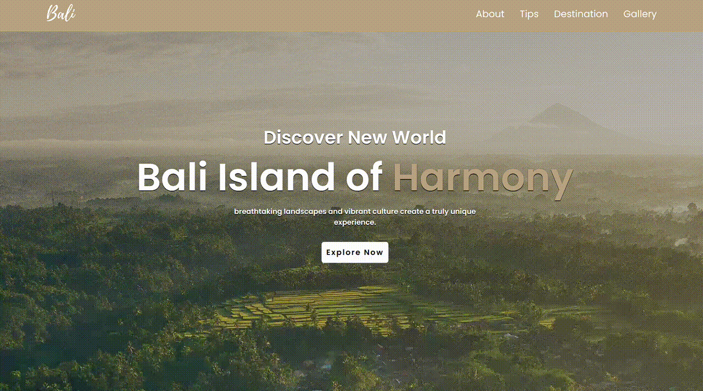

<!-- ABOUT THE PROJECT -->
## About The Project

A simple website introducing the beauty of Bali, complete with travel tips and must-visit destinations. 
Whether you're exploring the vibrant surf scene in Canggu, the cultural heart of Ubud, or the tranquil beaches of 
Lovina, this guide covers it all. Discover hidden gems, plan your itinerary, and get insider tips to make the most of your Bali adventure.

### Built With

* 
* 

<!-- GETTING STARTED -->
## Getting Started

### Run Locally

1. Clone the repo
2. Open the index.html file in the browser

<!-- DEMO -->
## Demo

